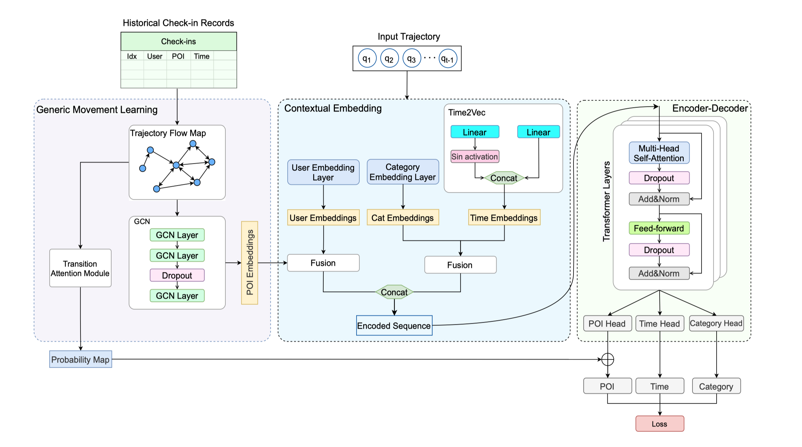

# GETNext

This is the pytorch implementation of paper "GETNext: Trajectory Flow Map Enhanced Transformer for Next POI
Recommendation"



## Installation

```
pip install -r requirements.txt
```

## Requirements

```
torch==1.7.1
numpy==1.19.2
prettytable==2.0.0
matplotlib==3.3.4
scipy==1.6.1
torch_summary==1.4.5
tqdm==4.58.0
pandas==1.1.5
data==0.4
PyYAML==6.0
scikit_learn==1.0.2
torchsummary==1.5.1
```

## Train

- Unzip `dataset/NYC.zip` to `dataset/NYC`. The three files are training data, validation data, test data.

- Run `build_graph.py` to construct the user-agnostic global trajectory flow map from the training data.

- Train the model using python `train.py`. All hyper-parameters are defined in `param_parser.py`

  ```
  python train.py --data-train dataset/NYC/NYC_train.csv 
  								--data-val dataset/NYC/NYC_val.csv 
  								--time-units 48 --time-feature norm_in_day_time
  								--poi-embed-dim 128 --user-embed-dim 128 
  								--time-embed-dim 32 --cat-embed-dim 32
  								--node-attn-nhid 128
  								--transformer-nhid 1024
  								--transformer-nlayers 2 --transformer-nhead 2
  								--batch 16 --epochs 200 --name exp1
  ```

## Citation

```
@inproceedings{10.1145/3477495.3531983,
  author = {Yang, Song and Liu, Jiamou and Zhao, Kaiqi},
  title = {GETNext: Trajectory Flow Map Enhanced Transformer for Next POI Recommendation},
  booktitle = {Proceedings of the 45th International ACM SIGIR Conference on Research and Development in Information Retrieval},
  pages = {1144–1153},
  series = {SIGIR '22}
}

```

